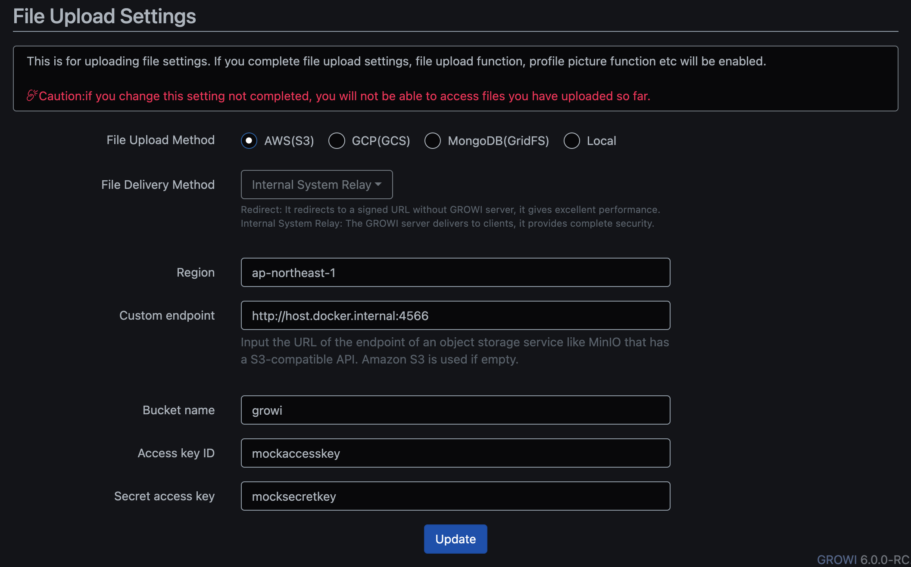

# AWS

## Supported Services

- [S3](#S3)


## Requirements

- [Docker](https://docs.docker.com/get-docker/)
- [Terraform](https://developer.hashicorp.com/terraform/downloads)
- [AWS CLI](https://docs.aws.amazon.com/cli/latest/userguide/getting-started-install.html)


## Getting Started

```sh
# create environment
docker compose -f aws/docker-compose.yml up -d
terraform -chdir=aws init
terraform -chdir=aws apply -auto-approve

# delete environment
terraform -chdir=aws destroy -auto-approve
docker compose -f aws/docker-compose.yml down -v
```

## S3

Some useful commands:

```sh
# upload file
aws s3 cp README.md s3://growi --endpoint-url=http://localhost:4566

# list buckets
aws s3 ls --endpoint-url=http://localhost:4566

# list files
aws s3 ls --endpoint-url=http://localhost:4566 growi --recursive
```

GROWI configuration example:


