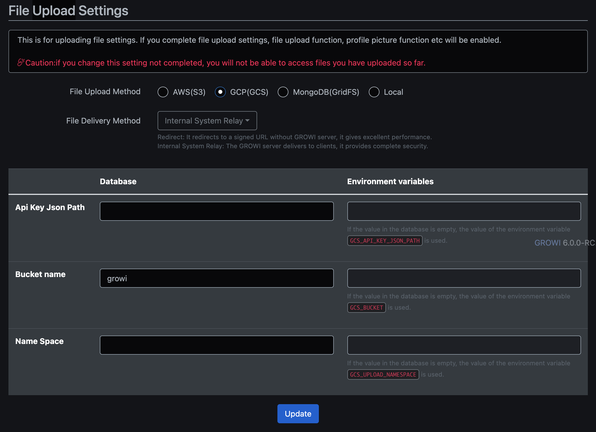

# GCP

## Supported Services

- [GCS](#GCS)


## Requirements

- [Docker](https://docs.docker.com/get-docker/)
- [Terraform](https://developer.hashicorp.com/terraform/downloads)
- [Google Cloud CLI](https://cloud.google.com/sdk/docs/install-sdk)


## Getting Started

```sh
# create environment
docker compose -f gcp/docker-compose.yml up -d
gcloud config configurations create growi
gcloud config set project growi
gcloud config set api_endpoint_overrides/storage http://localhost:4443/storage/v1/
terraform -chdir=gcp init
terraform -chdir=gcp apply -auto-approve

# delete environment
terraform -chdir=gcp destroy -auto-approve
docker compose -f gcp/docker-compose.yml down -v
```

### GCS

Some useful commands:

```sh
# upload file
curl -X POST 'http://localhost:4443/upload/storage/v1/b/growi/o?uploadType=media&name=README.md' --data-binary @README.md
# somehow this gives: HTTPError 400: invalid Content-Type header
# gcloud storage cp README.md gs://growi --access-token-file=gcp/token.txt

# list buckets
gcloud storage ls --access-token-file=gcp/token.txt

# list files
gcloud storage ls gs://growi --access-token-file=gcp/token.txt --recursive --long
```

GROWI configuration example:



To connect the storage from GROWI, make a little tweak to [`packages/app/src/server/service/file-uploader/gcs.js`](https://github.com/weseek/growi/blob/master/packages/app/src/server/service/file-uploader/gcs.js).

```diff
  function getGcsInstance() {
    if (_instance == null) {
      const keyFilename = configManager.getConfig('crowi', 'gcs:apiKeyJsonPath');
      // see https://googleapis.dev/nodejs/storage/latest/Storage.html
      _instance = keyFilename != null
        ? new Storage({ keyFilename }) // Create a client with explicit credentials
-       : new Storage(); // Create a client that uses Application Default Credentials
+       : new Storage({ apiEndpoint: 'http://host.docker.internal:4443', projectId: 'growi' }); // Create a client that uses Application Default Credentials
    }
    return _instance;
  }
```

```diff
  lib.isValidUploadSettings = function() {
-   return this.configManager.getConfig('crowi', 'gcs:apiKeyJsonPath') != null
-     && this.configManager.getConfig('crowi', 'gcs:bucket') != null;
+   return this.configManager.getConfig('crowi', 'gcs:bucket') != null;
  };
```